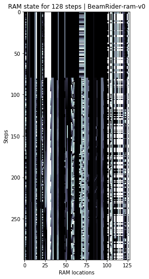
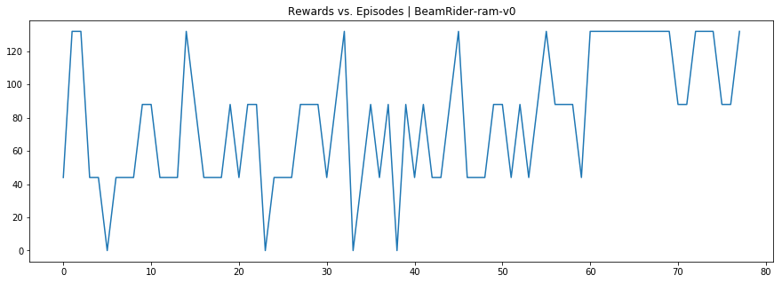

# Pytorch Script

This module has the pytorch script to play different games in RAM configuration. This was just a part of learning to use `pytorch`. Frankly I am way more used to `tensorflow` and prefer to use, it's just more familiar. However `pt_trans_ppo.py` can help you run and save the model.

# Image Samples

The state per step is the RAM values normalized between [0, 1] and for `Beam Rider` we get a reward of 44 for shooting down the enemy.

